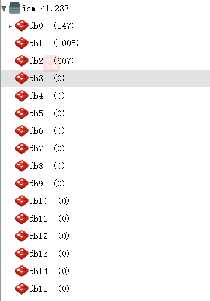
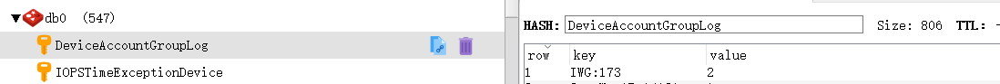
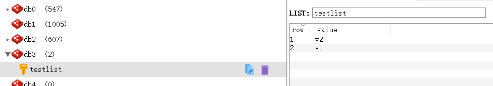
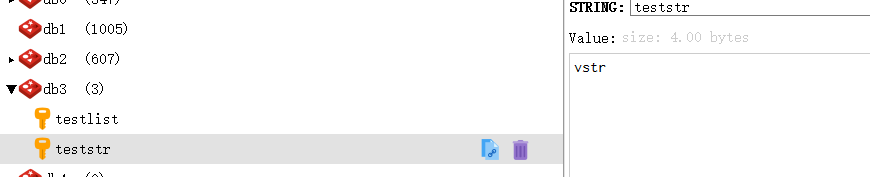
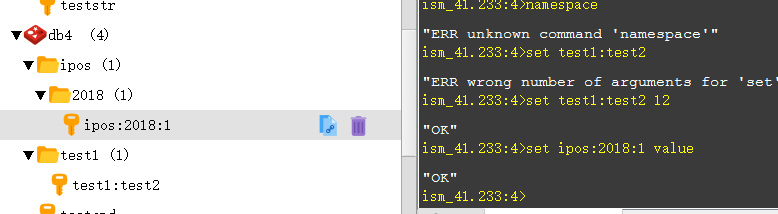

Redis是一个开源的使用ANSI C语言编写、支持网络、可基于内存亦可持久化的日志型、Key-Value数据库。

<!--more-->

桌面可视化工具可以使用 Redis Desktop Manager进行操作。

redis默认有db0 - db15 一共16个数据库。



## hash类型



## list类型



## str类型



## set类型

还有zset类型

## 命令行操作

``` bash
select 4 #选择db4这个数据库 select 0选择的就是db0这个数据库
set key value #设置了key为字符串的值value
keys * #查看所有的key
hmset mainkey name testname value testvalue #设置了一个hash，key是mainkey，value里面是name:testname, value:testvalue
hgetall mainkey #返回mainkey对应的值
lpush testlist v1 #key是testlist，值是列表，增加了一个值v1
lrange testlist 1 10 #获取testlist的1-10之间的值
```

## 命名空间



