主要记录了学习网络协议的笔记。

下面主要参考了 《TCP/IP详解卷1》 里面的内容。本文大多是截取了里面的图作为记录，少部分会增加文字便于个人理解。

<!--more-->

## 网络分层

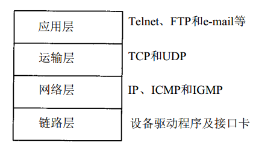

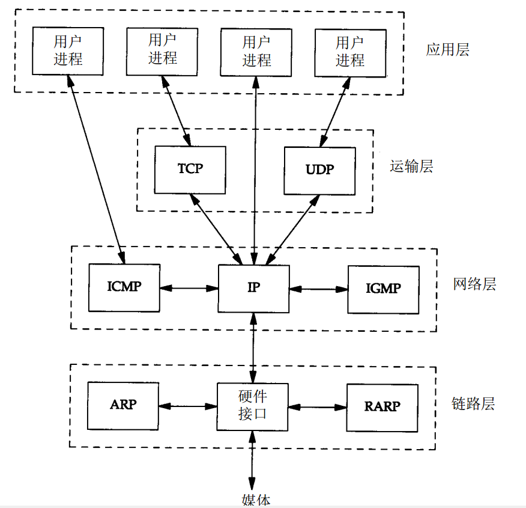

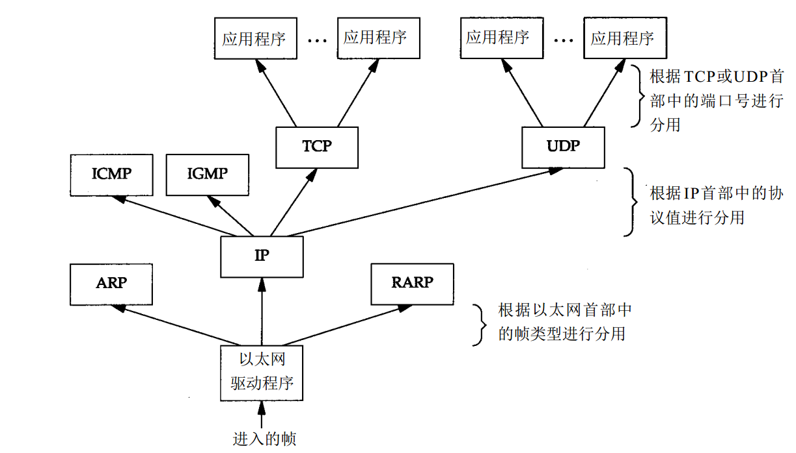

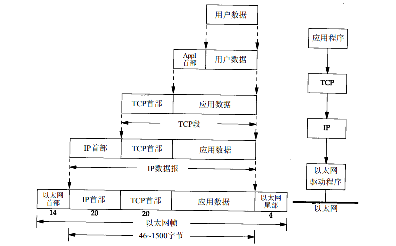

为协议ICMP和IGMP定位一直是一件很棘手的事情。把它们与IP放在同一层上，那是因为事实上它们是IP的附属协议。但是在这里，我们又把它们放在IP层的上面，这是因为ICMP和IGMP报文都被封装在IP数据报中。

对于ARP和RARP，我们也遇到类似的难题。在这里把它们放在以太网设备驱动程序的上方，这是因为它们和IP数据报一样，都有各自的以太网数据帧类型。我们又把ARP作为以太网设备驱动程序的一部分，放在IP层的下面，其原因在逻辑上是合理的。

这些分层协议盒并不都是完美的。

## IP

### ip地址

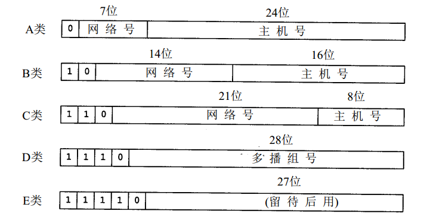

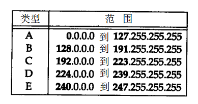

其中127就是01111111.

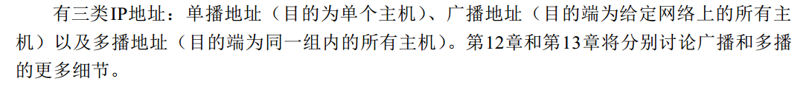

### ip协议

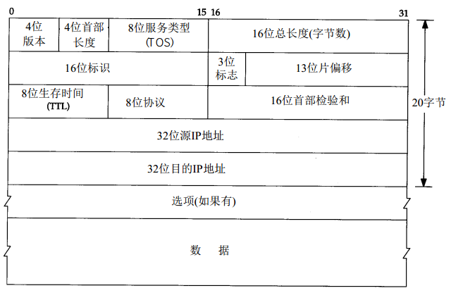

#### 常用协议号

> 常用的协议号： 1 -- ICMP, 2 -- IGMP, 6 -- TCP, 17 -- UDP，同理TCP/UDP通过端口表示上层协议，

## UDP

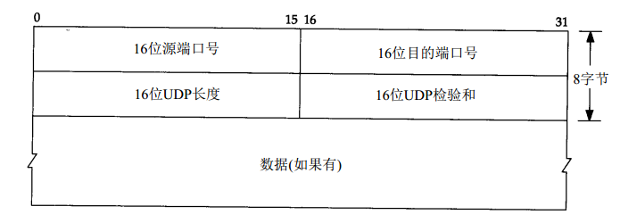

## TCP

TCP首部一般是20个字节。

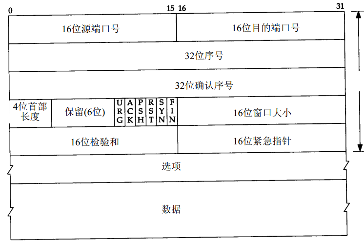

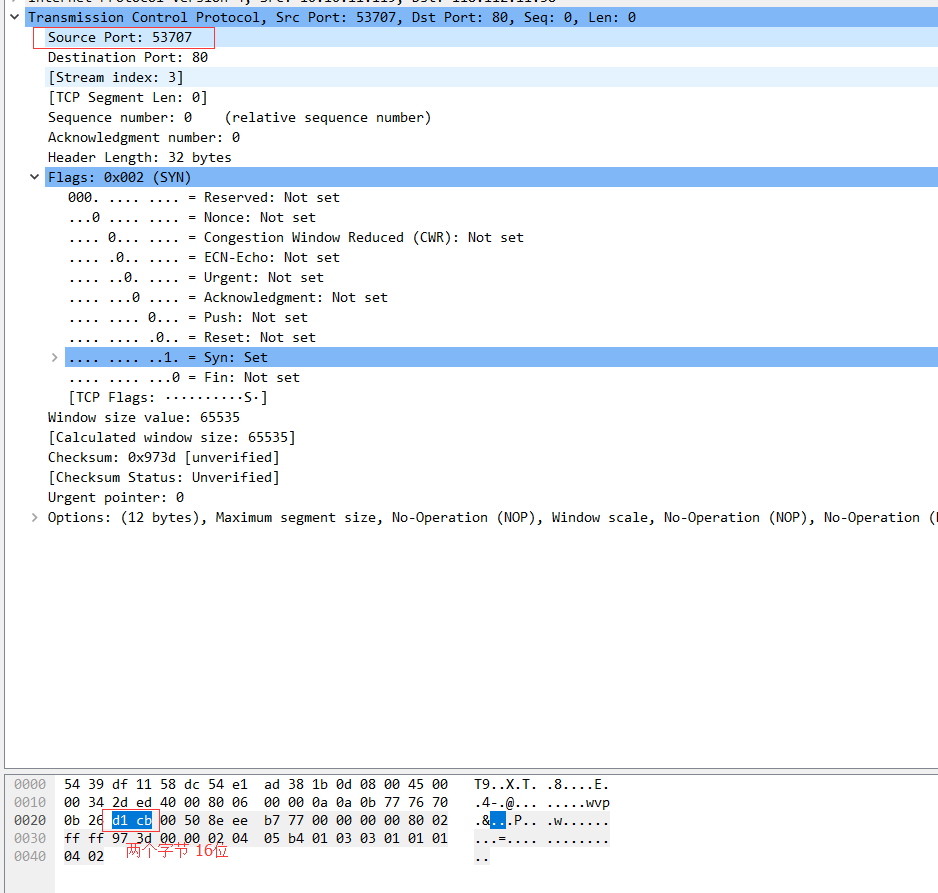

## HTTP

