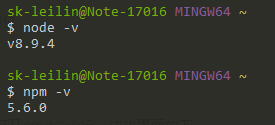
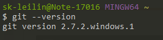
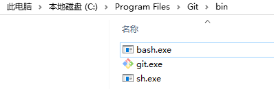
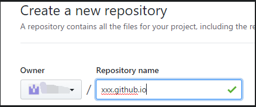
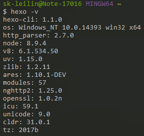
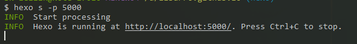

本文是在windows10下进行的配置。
<!--more-->

参考链接：
1. https://www.cnblogs.com/fengxiongZz/p/7707219.html
1. https://www.jianshu.com/p/beb8d611340a

## node.js安装

下载好node.js后安装完成后，输入如下命令表示成功：



## git安装

下载好[git](https://git-scm.com/)，安装完成后，输入如下命令表示成功：



如果命令失败，需要把git安装目录下的bin目录加入到环境变量里面，比如我的是："c:/Program Files/Git/bin"，这个目录下有如下几个文件



## github配置

进入[github](https://github.com/)注册一个账号，并且创建一个repository，注意名字必须是username.github.io格式，username是你注册的用户名。



可以通过https://username.github.io/的方式访问你的首页了。

## 安装hexo

在任何适合的地方通过下面的命令安装

``` bash
npm install hexo -g
```

输入下面的命令，表示安装成功：



然后使用下面命令初始化hexo

``` bash
hexo init
```

使用下面的命令安装依赖

``` bash
npm install
```

使用下面的命令生成页面

``` bash
hexo g
```

使用下面的命令启动服务器

``` bash
hexo s
```



根据提示访问这个网页，如果打不开，使用下面的命令修改端口号

``` bash
hexo s -p 5000
```

当然你可以启用debug信息：

``` bash
hexo s -p 5000 --debug
```

有时候发现浏览器更新不及时，使用下面的命令清理缓存

``` bash
hexo clean
```

打开页面后出现下面的界面表示配置成功


## hexo与github关联

至于github上的权限等配置，这里不讲诉，本文只说明hexo与github的关联配置信息。

在我们刚刚操作的目录下有一个`_config.yml`文件，请在最后添加如下内容：

``` git
deploy:
  type: git
    repository: git@github.com:yourname/yourname.github.io.git
      branch: master
```

注意修改yourname为你自己的username

在发布以前需要安装下面的插件：

``` bash
npm install hexo-deployer-git --save
```

安装好以后使用下面的命令：

``` bash
hexo d
```

使用下面的命令可以重新生成页面(推荐使用这个命令)

``` bash
hexo d -g
```

完成后，通过yourname.github.io就可以访问你的网页了。

## 新建文章

``` bash
hexo n name
```

注意生成的文件在`source\_posts`这个目录下面，是一个md文件。

其中name替换成你想要的名字，会在`source\_posts`下生成你新建的文件，默认是md格式的，可以打开这个文件按照md的格式进行编写文章了。

如果需要图片支持，需要安装下面的插件：

``` bash
npm install hexo-asset-image --save
```

以后使用hexo n命令的时候，会在文章`source\_posts`这里生成和你文件名对应的目录，文章里面使用md语法``的格式插入图片了。

## hexo配置文件

### 根目录`_config.yml`配置

``` bash
title: Title
subtitle:
description:
keywords:
author:
language: zh-CN #语言，这个在theme\languages目录下的对应
timezone: Asia/Shanghai #时间
```

``` bash
category_map:
  PYTHON: python
  ROBOTFRAMEWORK: robotframework
  LINUX: linux
  ENGLISH: english
  DATABASE: database
  TOOLS: tools
  MARKDOWN: markdown
  OTHER: other
```
这里是每个文章的categories字段，生成对应的url，默认生成的是categories字段，如果这里面有中文，url里面也会包含中文，这里就可以对它进行映射，使url里面无中文。

``` bash
theme: cactus #配置主题，和theme下面的名字一样
```

### theme下`_config.yml`配置

``` bash
nav:
  home: /
  python: /categories/python
  robotframework: /categories/robotframework
  linux: categories/linux
```
这里主要是对导航栏进行配置，注意我的主题是cactus，每个主题的配置有所不一样。

### 文章里面的配置

``` bash
---
title: '[redis]-基本操作' #文章标题，可以和文件名不一样
date: 2018-04-27 19:07:35 #创建时间
tags: #tag
categories: DATABASE # 这里就是分类，可以使用[a, b]方式，表示多类
---

<!--more--> #有的主题会显示文章的全部内容，这里可以进行区分，后面的内容就不会默认显示在首页了。
```


## 在其它机器写文章

我们现在所有的文件都是在当前机器上进行的，怎么换到其它机器上写文章呢。

我们在任意一个地方使用下面的命令：

``` bash
git clone https://github.com/yourname/hexo-test.github.io.git
```

注意替换相应的内容，克隆我们的服务器文件，
然后删除里面的所有内容，注意如果你开启了查看隐藏文件的功能，不要把`.git`这个文件删除
然后使用下面的命令创建一个分支，我们取名叫hexo，这个名字按照自己喜好命名：

``` bash
git checkout -b hexo
```

然后把你自己写文章的目录下的所有内容拷贝过来。

分别使用如下的命令进行提交：

``` bash
git add --all
```

``` bash
git commit -m "Create new branch(hexo)."
```

``` bash
git push --set-upstream origin hexo
```

这时候我们的github上就会多一个hexo分支，以后其它机器就可以通过下面的命令进行克隆代码，到其它机器写文章了。

``` bash
git clone -b hexo your_git_url
```

注意以后写文章，提交到git，尽量使用下面的命令进行提交

``` bash
git push origin hexo
```

## 主题

本文以NexT为主题，进入的你站点目录下，使用命令：

``` bash
git clone https://github.com/iissnan/hexo-theme-next themes/next
```

进行安装，然后修改站点的config文件，修改：

``` bash
theme: next
```

以后的配置都是在这个主题下进行配置。

## 评论功能增加


