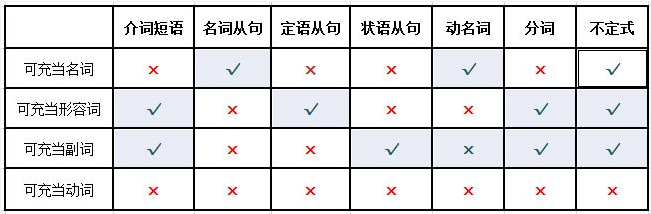

本文主要记录了个人学习英语语法的一些备忘录。

<!--more-->

## 表语

表语是紧跟系动词之后的结构，一般称及物动词之后的结构为宾语，系动词之后的结构为表语。
表语用来表述主语的身份，状态，特征等信息。

He looks good. look这里作为系动词，good是一个形容词，作为表语。

常用的系动词有：

> am/is/are keep seem appear become feel get grow remain smell look sound stay taste

大多数情况，系动词也具有及物动词的词性，请看下面的两个keep：

### 句1
I *keep* silent in class.

### 句2
I *keep* books in my room.

### 我们先看下系动词的两个特点
1. __系动词后可以跟名词和形容词，而及物动词后只能跟名词__
2. __系动词在替换为be动词之后，句子语义基本不变__

请看：

系动词之后接名词：
Adventure *becomes* a part of my life.
Pollution *remains* a troubling problem.

系动词之后接形容词(一般及物动词不具有这个特性)：
She *looks* a little tired.
The shop *stays* open.

系动词替换为be动词之后，语义基本不变：
Adventure *is* a part of my life.
She *was* a little tired.

好，现在来看[句1](#句1)和[句2](#句2)的比较：
根据[系动词特点](#我们先看下系动词的两个特点)1，可以发现[句子1](#句1)中的*keep*肯定是系动词，应为silent是形容词，及物动词不具有这个特性。
那么根据[特点1](#我们先看下系动词的两个特点)无法判断[句子2](#句2)的*keep*属性，因为book是一个名词，系动词和及物动词都有这个特性，那么根据[特点2](#我们先看下系动词的两个特点)进行判断，把*keep*替换为be动词查看语义是否变化：
I is books in my room.显然这个句子是有歧义的，那么就不是系动词，因为替换后的语义都变化了，所以这里也不能进行替换，那么*keep*就是一个及物动词。i

## 定语

定语是一个广义的概念，其本质是形容词词性，可以修饰名词和代词。

## 状语

类似于定语，是一个广义的概念，本质是副词词性，可以修饰除了名词和代词以外的结构，比如动词，形容词，副词

## 补语

补语是对宾语的补充说明。

中文的补语：有一类动词可以改变宾语的动作或者状态，例如： 我要求学生们去学习跳舞，要求这个动词，如果省略了补语，句子意义不完整： 我要求学生们，宾语加上补语，可以单独成句，并且意义变换不大，学生们去学习跳舞。

英语的补语也类似， I have my hair dyed. have在这里表示 使得，把 的意思， I have my hair去掉补语句子意义不完整，my hair be dyed, 句子意义基本不变。

其实补语是由名词从句省略得来的。

I found that the homework was difficult.
I found the homework difficult.

形容词，不定式，分词等结构都可以作为补语。

## 注意每个单词的词性

比如 more than 这个词组

首先我们看一下more这个词通过字典查出来的词性：

We had more than they did. 这里的more是名词，`更多`的意思

We had more food that they did. 这里的more是形容词，修饰food，表示`更多的`的意思

We talked more than they did. 这里的more是副词，修饰talk，表示`更多`的意思

## 语法框架

名词：主 宾 表 补
形容词：定 表 补
副词： 状
动词： 谓

英语中绝大部分句子是由 "__四大词性__" 和 "__七类辅助结构__"构成的，也就是 名词 形容词 副词 动词 和 介词短语 名词从句 定语从句 状语从句 动名词 分词 不定式。

## 参考链接

https://zhuanlan.zhihu.com/adingdemao
