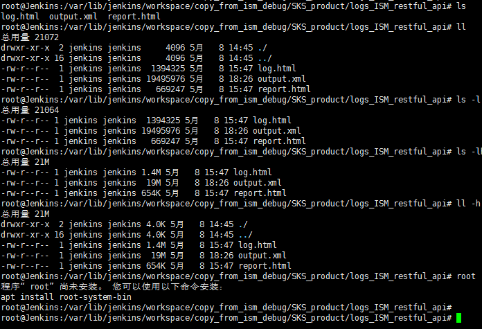

本文收录了个人常用的linux命令，很基础的一些命令就没有列举了。

<!--more-->

## ls



## find

## grep

用于匹配查找

``` bash
grep ISM_Base_0490 output.xml #在output.xml文件中查找ISM_Base_0490
```

-n: 打印所在行
-v: 反向匹配
-i: 忽略大小写


## dh/df

## top

## ps
