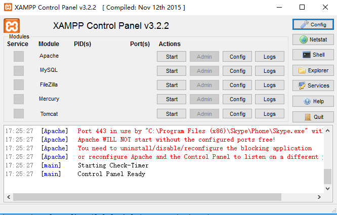
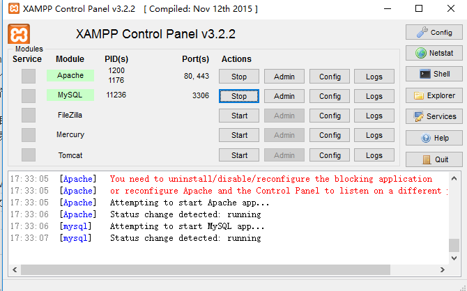
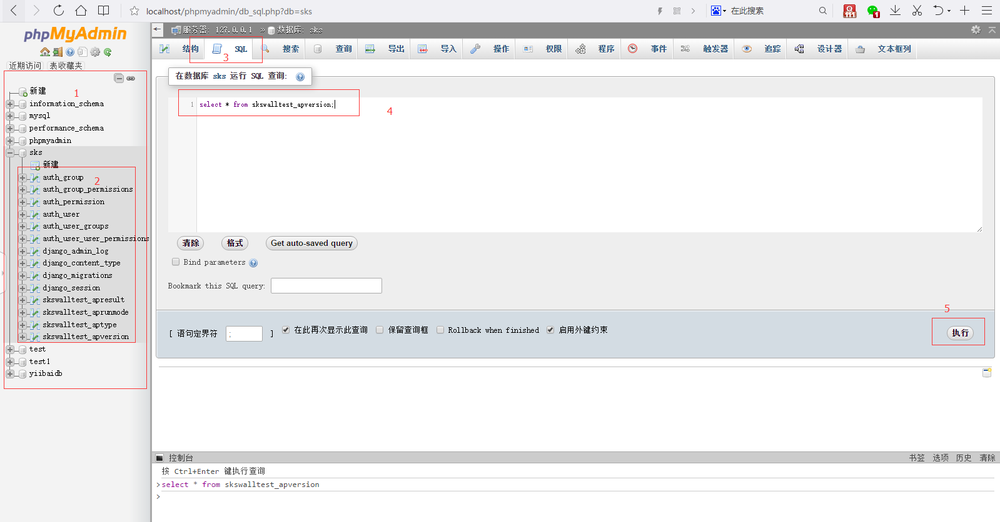

本文主要介绍了学习sql语句的环境配置，主要使用windows+xampp进行一键环境搭建，用于学习sql基本语句已经完全够用。

<!--more-->

## xampp的配置

[xampp](!https://www.apachefriends.org/zh_cn/index.html)是一个强大的建站集成软件包，里面包含了Apache, Mysql, PHP等常用的环境。而且支持Windows, Linux, Mac OS等环境，语言也支持中文。本文以windows为例进行配置。

下载好xampp以后，全部默认点击下一步就可以安装完成，默认一般安装在c:\xampp这个位置，桌面也会生成xampp的快捷方式，打开后类似如下界面：

分别把Apache和MySQL启动起来，其它的不在本文讨论范围，启动后类似界面如下：

点击MySQL的Admin，将会打开一个浏览器窗口，类似如下界面：

其中红色框内的几个区域说明如下：
区域1：表示当前mysql数据库里面有哪些数据库
区域2：表示当前选中的数据库sks下面有哪些数据表
区域3和区域4：表示对选中的数据库进行SQL语句，也就是以后使用SQL语句进行增删查改操作的地方
区域5：最后执行

OK,经过上面的配置，基本的使用mysql来学习SQL语句已经可以满足要求了。
