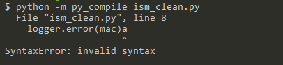

本文主要备注一些python好用的命令行。

<!--more-->

## 编译py文件

当有一个py文件不能直接运行，但是需要查看语法等是否有误，可以使用如下命令：

``` python
py -m py_compile xx.py
```

如果没有报错，不会有回显，并且会在xx.py对应目录下生成xx.pyc文件，如果有错，类似下面的回显：



## pip相关命令

### 升级

比如升级自己

``` python
pip install --upgrade pip
```
