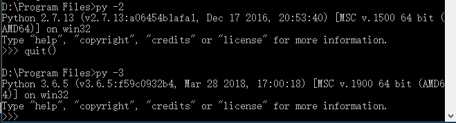
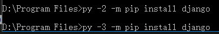
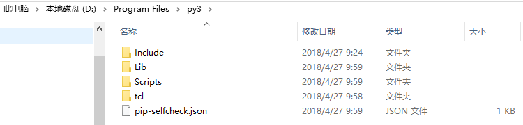
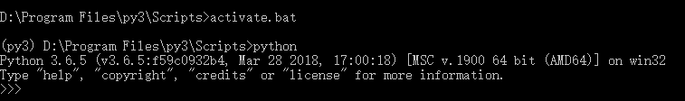
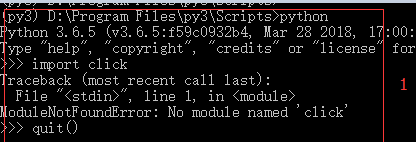
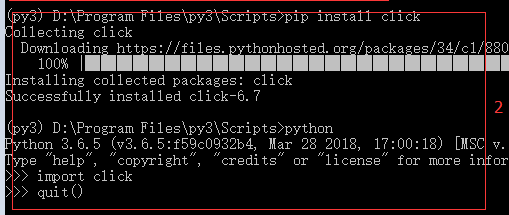
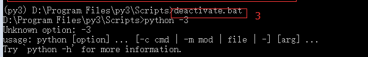
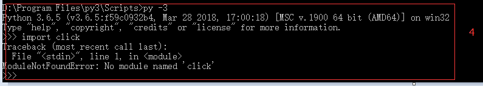

现在python有python2和python3两个版本，在windows上支持同时安装这两个版本的解释器，那么如何快速切换我们的开发环境呢。

<!--more-->

首先如果只是作为调试，我们可以使用py -2和py -3命令来进入python的版本。



同理，pip也支持：



下面说一下virtualenv这个工具的使用，看下面的实例：

``` base
D:\Program Files>virtualenv -p "D:\Program Files\Python3\python.exe" py3
```

机器上安装了py2，在c:\python27下面，也安装了py3，在d:\program files\python3下面

现在使用上面的命令，会在在d:\program files\下面生成一个py3的文件夹，-p参数指定了这个环境的解释器版本

里面内容类似：



我们进入scripts目录下执行active.bat：



可以看见直接使用的是python命令，并且进入了python3的环境。注意上面的实际配置路径需要根据你自己机器上的路径配置。

virtualenv工具的作用就是创建一个独立的python开发环境，这里面的所有环境都是独立的，不会影响你原来的环境等信息(当然可以认为的修改)。

我们来看一下pip的使用：





红色区域1：在虚拟环境下进入python，引入一个click库，由于没有安装，所以引入失败
红色区域2：我们在虚拟环境下使用pip install click安装了click这个库，再次引入，成功了
红色区域3：调用deactive.bat退出当前的虚拟环境
红色区域4：进入系统的python3,引入click，引入失败，因为虚拟环境没有改变我们的外部环境

virtualenv还有很多的参数，通过：
```
virtualenv -h
```
可以查看帮助信息

备注：
py.exe 可以在c:/Windows下找到
virtualenv.exe 可以在c:/Python27/Scripts下找到，当然根据你实际安装环境来决定位置
