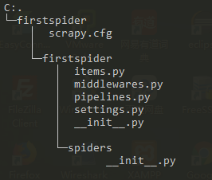

本文主要记录了python的scrapy爬虫框架的使用。本文使用python2.7版本。

<!--more-->

## 基本概念

## 安装配置

``` bash
pip install scrapy
```

安装完成后，使用下面的命令创建项目

``` bash
scrapy startproject firstspider #这里的firstspider是你的项目名
```

生成的目录结构类似：



## 参考链接

http://python.jobbole.com/86405/
